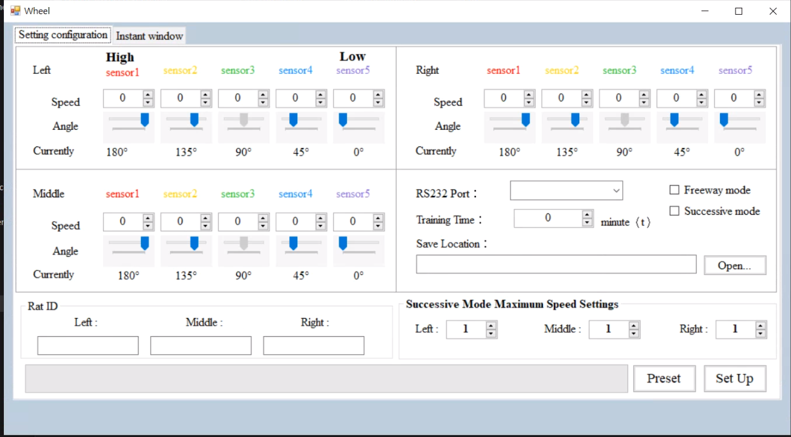
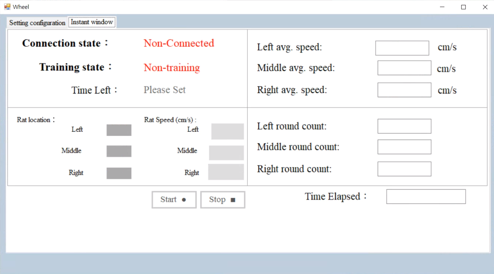
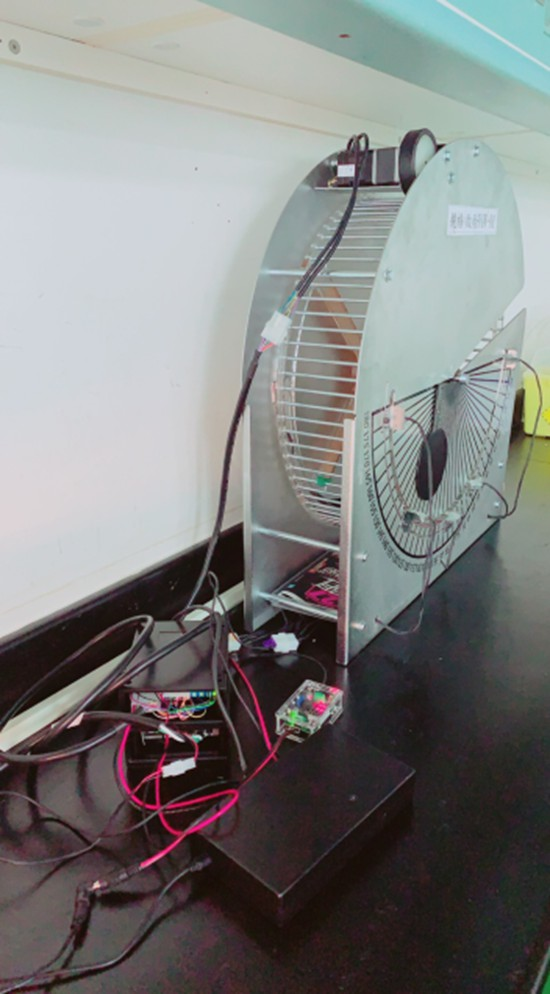
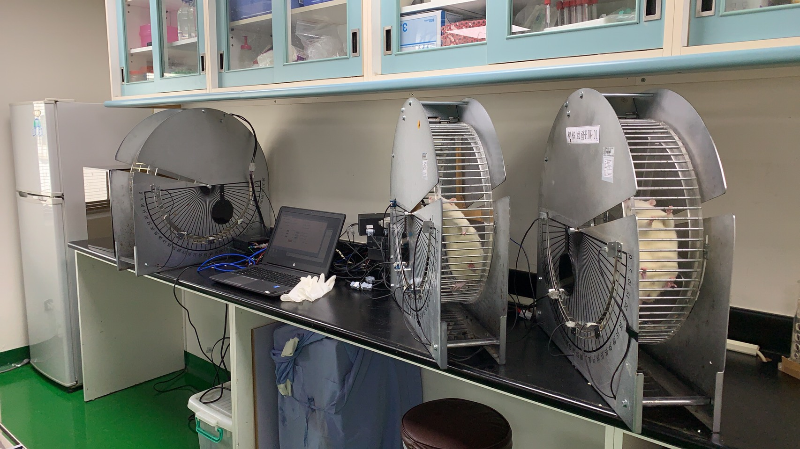

A medical training platform for lab rat.

# Introduction
This training platform has three set of running wheel, each one has five set of IR sensors equipped. The function of this platform is planned by medical researcher, I'm the one who only pursuit for implement the functions they required. The platform has two primary training modes:

- Normal mode
  - This mode recording the position of lab rat during specified training time (set with GUI), and apply specified speed (set with GUI) to the motor (through DAC) when lab rat reached a new position.

- Freeway mode
  - This mode is for new lab rat, which is not familar with the training platform. Under this mode, we only record the average speed of lab rat. The way we record the average speed is sticking a deep color tape on the wheel, and only enable one sensor to detect that tape, with this, each time the sensor detected the tape, it send data to PC to notify which wheel just detected the tape. And we do measured the diameter of the wheel, with this we can then calculate total distance the rat just ran, then divide it with total ran time, here we can conclude the average speed.

- IR sensor calibration mode
    - This mode is only used when the position of sensors is changed, and it's not within the main program, we provide a separated program to do the calibration, which is under `IR_calibration/`.

# Hardwares
- MCU
  - [EFM8LB12F64E](https://www.silabs.com/products/mcu/8-bit/efm8-laser-bee/device.efm8lb12f64e-qfp32)

- Sensors
  - IR transmitter
    - Common IR led, drive with 38Khz pulse.
  - [IR receiver](https://www.seeedstudio.com/Grove-Infrared-Receiver.html)

# Screenshot & Picture
- GUI
  - Settings                                             
    
  - Monitoring                                             
    
- Hardware                                                      
                                       
  
                                       

# TODO
- Merge the calibration mode into the main program, then we don't need to re-flash the mcu each time we want to do the calibration.
- Currently, our emergency stop is rely on busy evaluating pos of each wheel. If we prevent updating of DAC for dedicated wheel, we can save such busy evaluating, which has one more branches than the proposed one.

